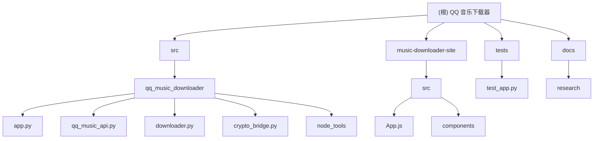

# QQ 音乐下载器

## 项目愿景

一个专注命令行体验的 QQ 音乐下载工具！基于 Textual 构建现代化 TUI，跨平台运行自如，把搜索、选择、下载、进度展示全部装进一个终端窗口。

## 架构总览



## 模块索引

| 模块路径 | 语言 | 职责 | 入口文件 | 测试覆盖 |
|---------|------|------|----------|----------|
| `src/qq_music_downloader/` | Python | 核心下载逻辑 | `app.py` | ✅ |
| `music-downloader-site/` | JavaScript/React | 前端展示网站 | `src/App.js` | ❌ |
| `tests/` | Python | 测试套件 | `test_app.py` | 基础 |
| `docs/research/` | JSON/JS | API 研究文档 | - | ❌ |

## 运行与开发

### 环境要求
- Python >= 3.11
- Node.js (用于前端)
- uv (推荐) 或 pip

### 快速启动
```bash
# 使用 uv (推荐)
uv run qqmusicdownloader

# 或使用 pip
python -m qq_music_downloader
```

### 开发模式
```bash
# 安装依赖
uv sync

# 运行测试
uv run pytest

# 代码检查
uv run ruff check
uv run ruff format
```

## 测试策略

- 单元测试：使用 pytest 框架
- 代码质量：使用 ruff 进行 linting 和格式化
- 集成测试：主要测试 API 接口和下载流程

## 编码规范

### Python 规范
- 遵循 PEP 8
- 使用 ruff 进行代码检查
- 类型注解优先
- 异步编程使用 async/await

### JavaScript 规范
- 使用 ESLint
- React Hooks 规范
- ES6+ 语法

## AI 使用指引

1. **代码修改优先级**：
   - 核心下载逻辑 > UI 交互 > 文档更新
   - 保持向后兼容性

2. **API 接口**：
   - QQ 音乐 API 经常变动，注意加密算法更新
   - Cookie 验证是关键入口

3. **测试要求**：
   - 新功能必须有对应测试
   - 保持测试覆盖率

## 变更记录 (Changelog)

### 2025-10-02
- 🆕 初始化架构文档
- ✨ 生成 Mermaid 结构图
- 📊 完成模块扫描与文档化

---

*最后更新：2025-10-02*